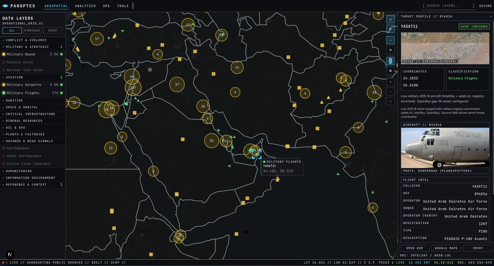
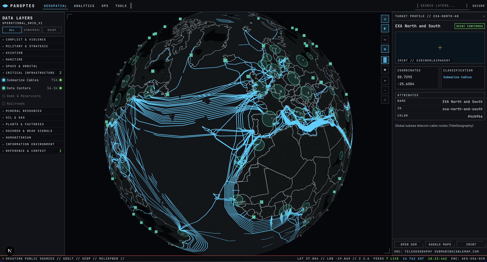
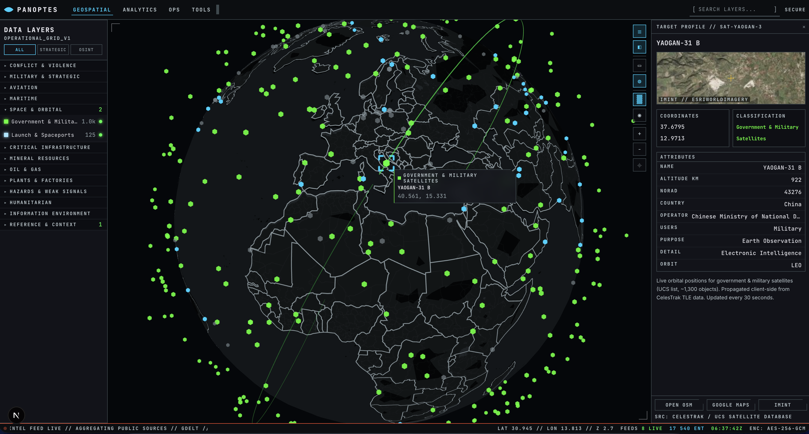
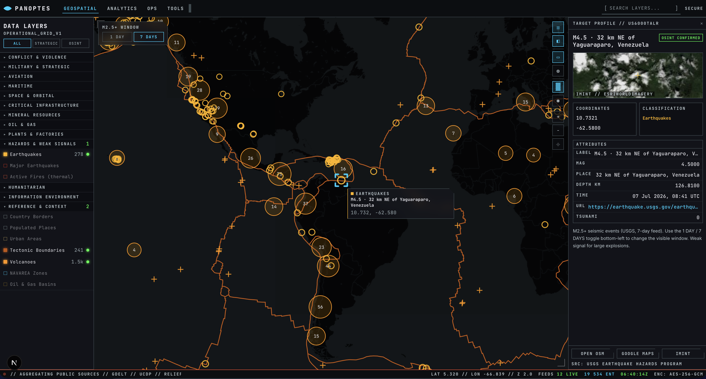
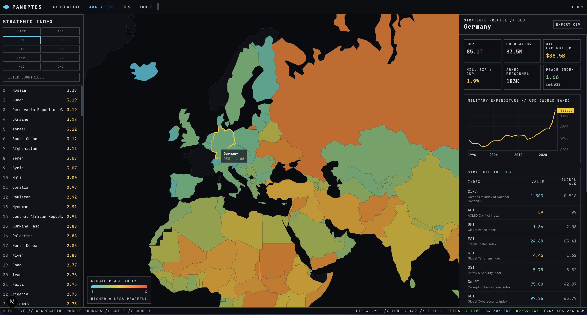
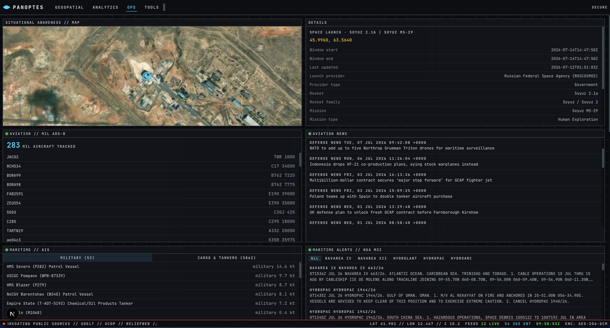

# Panoptes

Panoptes is a **global military-intelligence and geopolitics web application** built entirely on **public and OSINT data**. It combines a tactical geospatial map, country-level analytics, operational monitoring feeds, and analytic scenario tools (nuclear effects, missile range) in a single dark “Tactical Futurism” interface.

There is **no classified data**. Every layer carries source attribution in the UI. Panoptes is designed for research, situational awareness, and strategic context — not as a verified intelligence product.

## UI










## Features

### Geospatial

- Interactive **2D map** and **3D globe** (deck.gl + MapLibre basemap)
- **40+ toggleable data layers** grouped by theme (conflict, military, maritime, space, infrastructure, hazards, and more)
- Tactical **marker shapes and colors** per layer; clustering for dense datasets
- **Layer search** (desktop): find entities on enabled layers by name, ID, or key attributes
- **Entity detail panel** with attributes, map links (OSM / Google Maps / IMINT), flight/vessel/satellite intel where applicable
- **Live feeds**: military ADS-B flights, maritime AIS, government/military satellite propagation, GDELT media events, USGS earthquakes, and others
- Shareable map state via URL query parameters

### Analytics

- Country **choropleth maps** for strategic indices (GPI, GTI, FSI, GCI, CORPI, HDI, SSI, ACI, CINC, GHI)
- **Country profiles** with index breakdown, World Bank macro series, and World Factbook trade/resource fields
- CSV export of country indicator tables

### OPS

- Dashboard of **realtime and near-realtime feeds**: aviation, maritime AIS, orbital tracks, maritime warnings, multi-source news RSS, space weather, markets, energy/trade indicators
- **Source health** matrix showing live / degraded / stale status per feed
- Scrollable panel layout; usable on tablet and phone (see Mobile)

### Tools

- **Nuclear detonation** effects model (blast / thermal / fallout rings; Glasstone & Dolan scaling)
- **Missile trajectory** model (great-circle range, bearing, flight time)
- In-blast **asset analysis** against military bases, ports, data centers, and cities
- Markdown **SITREP export**

### Mobile / tablet

On phones and touch-first devices (including most iPads), Panoptes exposes **Geospatial** and **OPS** only, with full-screen layer/detail panels and touch-friendly map controls. Analytics and Tools are desktop-oriented. See the mobile banner in-app for scope.

## Quick start

### Prerequisites

- **Node.js 22+** and npm
- Optional: **`static-data/`** directory with raw source files (multi-GB) to rebuild GeoJSON — not required if committed assets in `public/geo` are present

### Install and run

```bash
npm install
npm run dev          # http://localhost:3000 — predev refreshes gov/mil TLE cache if stale
```

Most layers work **without API keys** (USGS, GDELT, adsb.lol military flights, static GeoJSON). Keys in **`src/.env`** (see [`.env.example`](.env.example)) unlock additional realtime feeds.

### Maritime AIS (live vessels)

AIS uses a **local WebSocket relay** (AISStream.io). Run in a second terminal:

```bash
# src/.env — AIS_STREAM_KEY from https://aisstream.io
npm run ais:relay    # ws://127.0.0.1:8787/ws
npm run dev
```

Enable **Maritime AIS** on the Geospatial map or open the OPS maritime panel.

### Rebuild static map data

If you have the raw **`static-data/`** dump:

```bash
npm run geo:build       # static-data/ → public/geo/*.geojson + public/data/country-indicators.json
npm run geo:tiles       # optional PMTiles (requires tippecanoe / GDAL)
npm run analytics:cache # World Bank Data360 + World Factbook → public/data/
npm run tles:fetch      # gov/military TLEs → public/data/gov-military-tles.json
```

## Data pipeline

Panoptes uses three data tiers:

| Tier               | Location               | Update                                                                                        |
| ------------------ | ---------------------- | --------------------------------------------------------------------------------------------- |
| **Static GeoJSON** | `public/geo/*.geojson` | `npm run geo:build` from `static-data/`                                                       |
| **Cached JSON**    | `public/data/*.json`   | `npm run analytics:cache`, `npm run tles:fetch`, build scripts                                |
| **Live APIs**      | `src/app/api/*`        | Fetched at runtime with in-memory TTL cache, circuit breaker, and `X-Panoptes-Health` headers |

**What refreshes automatically (runtime)**

While the app is running, **live and near-realtime feeds** update on their own — no rebuild scripts:

- **Geospatial API layers** — e.g. military flights (~60 s), GDELT (15 min), earthquakes (hourly), fires (15 min), maritime alerts, ReliefWeb disasters; client polling follows each layer’s `cadence` in the registry
- **Worker feeds** — satellite positions (30 s propagation from cached TLEs), maritime AIS (WebSocket relay when running)
- **Analytics profile APIs** — `/api/country`, `/api/macro`, `/api/worldfactbook`, HDX HAPI use server-side TTL caches (days–weeks) and may call upstream on cache miss
- **OPS panels** — RSS, markets, EIA/trade, space weather polled on panel-specific intervals

Stale upstream responses are served when providers fail (`X-Panoptes-Health` headers).

**What does _not_ refresh automatically**

Static map layers, choropleth indices, and most cached JSON bundles are **versioned files in the repo**. The running app reads them as-is until you rebuild and restart (or redeploy):

| Asset                               | Command                   | When to run                          |
| ----------------------------------- | ------------------------- | ------------------------------------ |
| GeoJSON layers + choropleth indices | `npm run geo:build`       | After updating `static-data/`        |
| World Bank + World Factbook caches  | `npm run analytics:cache` | Monthly or when WDI/Factbook updates |
| Gov/military TLEs                   | `npm run tles:fetch`      | Daily if orbital accuracy matters    |
| PMTiles (optional)                  | `npm run geo:tiles`       | After geo rebuild                    |
| Military aircraft registry          | `npm run geo:build`       | Included in geo build → `src/data/`  |

**Dev-only helper:** `predev` runs `scripts/ensure-fresh-tles.mjs` before `npm run dev` if the on-disk TLE cache is older than 24 h (requires Space-Track credentials). This does **not** run in production.

**Optional CI:** [`.github/workflows/data-refresh.yml`](.github/workflows/data-refresh.yml) can run `geo:build` daily when a `DATA_DUMP_URL` secret is configured (full `static-data` tarball). It does not run `analytics:cache` or `tles:fetch` today — add those jobs if you automate maintenance.

See **[`DATA_SOURCES.md`](DATA_SOURCES.md)** for the full source inventory (by view/layer) and § Maintenance for update schedules.

## Environment variables

Copy [`.env.example`](.env.example) into **`src/.env`**. Common keys:

| Variable                                      | Unlocks                               |
| --------------------------------------------- | ------------------------------------- |
| `AIS_STREAM_KEY`                              | Maritime AIS relay + vessel fallback  |
| `SPACETRACK_USER` / `SPACETRACK_PASS`         | Fresh gov/military satellite TLEs     |
| `OPENSKY_CLIENT_ID` / `OPENSKY_CLIENT_SECRET` | OpenSky gap-fill for military flights |
| `NASA_FIRMS_MAP_KEY`                          | NASA FIRMS active fires layer         |
| `CLOUDFLARE_API_TOKEN`                        | Internet outages layer                |
| `EIA_API_KEY` / `FRED_API_KEY`                | OPS economics panel                   |
| `RELIEFWEB_APP_NAME`                          | ReliefWeb disaster feed               |

## Scripts

| Command                           | Purpose                                                  |
| --------------------------------- | -------------------------------------------------------- |
| `npm run dev` / `build` / `start` | Next.js development / production                         |
| `npm run typecheck` / `lint`      | TypeScript and ESLint                                    |
| `npm run geo:build`               | Build GeoJSON and country indicators from `static-data/` |
| `npm run geo:tiles`               | Build PMTiles vector tiles                               |
| `npm run analytics:cache`         | Prefetch World Bank + World Factbook JSON                |
| `npm run tles:fetch`              | Fetch gov/military TLEs from Space-Track                 |
| `npm run ais:relay`               | Local AIS WebSocket relay                                |
| `npm run markers:validate`        | Validate marker color/shape registry                     |

## Architecture (brief)

- **Next.js 15** (App Router), **React 19**, **TypeScript**, **Tailwind CSS v4**
- **deck.gl** for map rendering (flat + globe); **Zustand** + **TanStack Query** for client state
- **Layer registry** ([`src/config/layer-registry.ts`](src/config/layer-registry.ts)) — one entry per layer drives the left rail, fetching, markers, and health badges
- Normalized **`GeoEntity`** model for clustering, selection, search, and detail panels

## Deployment notes

- Targets **Vercel** (serverless API routes + static assets)
- **Maritime AIS** requires a persistent WebSocket relay — not suitable for pure serverless; run relay separately or use snapshot fallback (`/api/vessels`)
- Large raw **`static-data/`** is not in git; derived **`public/geo`** and **`public/data`** are committed for standalone deploy
- Repo size and Vercel limits should be considered before bundling full static dumps

## Licensing and attribution

GNU GPLv3.

This project is not affiliated with or endorsed by any of the data providers.

Each layer lists source and license in the app (detail panel **SRC:** line and layer registry). Nuclear and missile models use public scaling laws (Glasstone & Dolan; great-circle ballistics). Verify upstream terms before redistributing raw data.

[Argus Panoptes](https://en.wikipedia.org/wiki/Argus_Panoptes), a figure from Greek mythology, is a many-eyed giant known for his perpetual vigilance.

## Future improvements

- **Global weather layer** (Geospatial): current conditions, forecasts, and extreme-weather highlights as a toggleable layer — complementary to existing METAR/SIGMET on military airports
- **Nightlights** (Geospatial): nightlights data from [NASA Black Marble](https://www.earthdata.nasa.gov/data/projects/black-marble)
- **Smoke Plumes** (Geospatial): smoke plumes as a weak signal and a proxy data layer from [NOAA wildfire smoke plume data](https://developer.weather.com/docs/openapi/ospo-hms-smoke-2-0)
- **Electric Power Grid Data** (Geospatial): display electric power grid infrastructure data from OSM with [MapYourGrid](https://github.com/open-energy-transition/MapYourGrid) and [openinframap](https://github.com/openinframap/openinframap)
- Analytics and Tools **mobile layouts**
- **Timeline playback** when historical track data (AIS archives, flight history) is integrated
- Production **AIS relay** deployment; optional Redis cache for API routes
- PMTiles / dense vector layers on the 3D globe

## Documentation

- **[`DATA_SOURCES.md`](DATA_SOURCES.md)** — complete data source catalog by view and layer
- **[`.env.example`](.env.example)** — API keys and configuration
